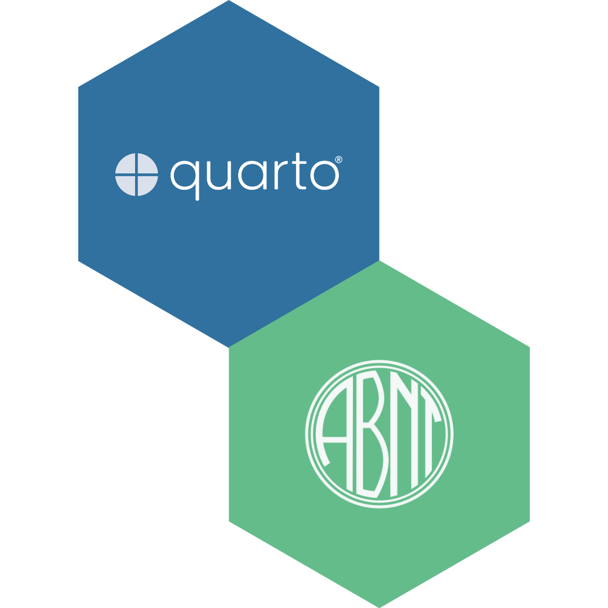

<div align="center">



# quarto-abnt

**Template Quarto para trabalhos acadêmicos no padrão ABNT**
*(monografias, dissertações, teses, TCCs e artigos)*

[](https://github.com/flaviohugo14/quarto-abnt/generate)
[](LICENSE)

[](https://github.com/flaviohugo14/quarto-abnt/actions/workflows/render.yml)
[](https://quarto.org/)
[](https://www.r-project.org/)
[](https://www.latex-project.org/)
[](https://github.com/flaviohugo14/quarto-abnt/stargazers)
[](https://github.com/flaviohugo14/quarto-abnt/network/members)

</div>

---

## ✨ Por que usar

Escrever um trabalho acadêmico em conformidade com a ABNT envolve dezenas de pequenas regras (margens, espaçamento, formatação de citações, listas pré-textuais, sumário, etc.) que tendem a consumir tempo desproporcional ao seu valor. Este template entrega tudo isso pronto, com a flexibilidade do Quarto para integrar texto, código R/Python, figuras e tabelas em um único `.qmd`.

- 📐 **ABNT pronto** — margens (3 cm/2 cm), Times New Roman 12pt, espaçamento 1,5, numeração no canto superior direito (NBR 14724).
- 📚 **Citações via CSL** — sem precisar lidar com `biblatex`. O arquivo `csl/abnt.csl` segue NBR 10520 e 6023, autor-data.
- 🧩 **Tudo dirigido por YAML** — capa, folha de aprovação, dedicatória, agradecimentos, resumo, abstract, lista de siglas: você só preenche metadados.
- 🔬 **Reprodutível** — chunks R/Python, figuras geradas em tempo de render, tabelas com `kable` ou `gt`.
- 🤖 **CI incluso** — GitHub Action que renderiza o PDF a cada push e disponibiliza o artefato.
- 🪶 **Sem dependências exóticas** — só XeLaTeX, Quarto e (opcionalmente) R. Sem `biblatex`/`biber`.

---

## 🚀 Começando em 3 passos

### 1. Use o template

Clique em **[Use this template](https://github.com/flaviohugo14/quarto-abnt/generate)** ou clone:

```bash
git clone https://github.com/flaviohugo14/quarto-abnt.git meu-trabalho
cd meu-trabalho
```

### 2. Instale os pré-requisitos

| Ferramenta | Versão | Instalação |
|---|---|---|
| [Quarto](https://quarto.org/docs/get-started/) | ≥ 1.4 | `brew install quarto` ou instalador oficial |
| [TinyTeX](https://yihui.org/tinytex/) | qualquer | `quarto install tinytex` |
| [R](https://www.r-project.org/) | ≥ 4.2 | apenas se usar chunks R |
| Times New Roman | — | já presente em macOS/Windows; em Linux use `fonts-liberation` |

### 3. Edite e renderize

```bash
quarto render index.qmd
# Saída: _output/index.pdf
```

Edite o YAML no topo de `index.qmd` (capa, banca, resumo) e o conteúdo dos capítulos. Pronto.

---

## 🗂️ Estrutura

```
.
├── index.qmd                Documento principal (YAML + texto + chunks)
├── _quarto.yml              Configuração do projeto Quarto
├── tex/
│   ├── doc-class.tex        Classe LaTeX e formatação ABNT
│   └── before-body.tex      Elementos pré-textuais (capa, resumo, listas, sumário)
├── csl/
│   └── abnt.csl             Estilo de citação ABNT (NBR 10520/6023)
├── references/
│   └── references.bib       Bibliografia BibTeX (substitua pelas suas referências)
├── images/                  Figuras estáticas
├── .github/workflows/
│   └── render.yml           CI: renderiza o PDF a cada push
├── LICENSE                  MIT
└── README.md                Este arquivo
```

---

## ⚙️ Personalização via YAML

Todos os elementos pré-textuais são gerados a partir do YAML. Campos opcionais (epígrafe, coorientador, lista de siglas, abstract em inglês) são silenciosamente omitidos quando ausentes.

```yaml
title: "Título do Trabalho"
author: "Nome Completo"
author-upper: "NOME COMPLETO"            # versão em caixa-alta para folha de aprovação
registration_number: "00000"             # opcional

institution: "UNIVERSIDADE FEDERAL DE EXEMPLO"
city: "Cidade"
state: "UF"
month: "Janeiro"
year: "2025"

advisor: "Prof. Dr. Nome do Orientador"
advisor-name: "Nome do Orientador"       # variante curta na linha de assinatura
coadvisor: "Prof. Dra. Nome"             # opcional
examiner1: "Prof. Dr. Examinador 1"
examiner2: "Prof. Dr. Examinador 2"
confirm_date: "01/01/2025"
confirm_text: "Trabalho apresentado ao Programa..."

dedication: "Dedico este trabalho a..."
acknowledgement: "Agradeço a..."
epigraph: "Texto da epígrafe."           # opcional
epigraph-author: "Autor (Ano)"           # opcional

abstract: "Resumo do trabalho..."
keywords: "Palavra 1. Palavra 2."
abstract-en: "English abstract..."        # opcional
keywords-en: "Keyword 1. Keyword 2."     # opcional

siglas:                                   # opcional
  - { short: "ABNT", long: "Associação Brasileira de Normas Técnicas" }
  - { short: "IBGE", long: "Instituto Brasileiro de Geografia e Estatística" }
```

---

## ✍️ Citações no texto

```markdown
Segundo @keynes1936, ...               <!-- Keynes (1936) -->
... como já discutido [@solow1956].    <!-- (Solow, 1956) -->
... mostrou Krugman [-@krugman1991].   <!-- supressão do autor -->
[@keynes1936; @solow1956]              <!-- múltiplas -->
```

Citações longas (mais de 3 linhas) usam o ambiente `citacao` do `doc-class.tex`:

```markdown
\begin{citacao}
Texto recuado em 4 cm, fonte menor, espaçamento simples.
\end{citacao}
```

---

## 📊 Tabelas e figuras

```r
#| label: tbl-exemplo
#| tbl-cap: "Legenda da tabela"
knitr::kable(df, booktabs = TRUE)
```

```r
#| label: fig-exemplo
#| fig-cap: "Legenda da figura"
ggplot(df, aes(x, y)) + geom_line()
```

Use `@tbl-exemplo` e `@fig-exemplo` no texto para referências cruzadas.

> **Atenção:** Quarto não suporta forward references. Os chunks devem aparecer **antes** do texto que os referencia.

---

## 🤖 Renderização contínua

A action em `.github/workflows/render.yml` instala Quarto, TinyTeX, R e dependências, renderiza `index.qmd` e publica o PDF como artifact em cada push e PR. Para baixar o PDF mais recente, vá em **Actions → Render PDF → último run → Artifacts**.

---

## 🛠️ Dicas e armadilhas conhecidas

- **`pdf-engine: xelatex`** é obrigatório no YAML — `pdflatex` quebra com Unicode da bibliografia.
- **Não carregue `biblatex`** em `doc-class.tex`. As citações são renderizadas pelo pandoc via CSL. O Quarto pode reportar falsos "missing packages" (`abnt.dbx`, `nil.lbx`) se você ignorar isso.
- **`escape = FALSE` em `kable`** permite math nas células, mas você precisa escapar manualmente `_`, `%`, `&`, `#`, `$`.
- **`kable_styling(latex_options = "scale_down")`** *aumenta* tabelas estreitas (porque embrulha em `\resizebox{\linewidth}{!}{...}`). Use só quando estourar a margem.
- **Forward references não funcionam** — coloque os chunks de figura/tabela antes do texto que cita `@fig-`/`@tbl-`.

---

## 📄 Exemplos do mundo real

Este template foi extraído da minha dissertação de mestrado e validado por mais de 250 páginas de produção acadêmica. Veja em uso:

- **[masters-thesis](https://github.com/flaviohugo14/masters-thesis)** — *Digitalização Bancária e Assimetrias Regionais no Brasil* (CEDEPLAR/UFMG, 2026)

Está usando o template? Abra um PR adicionando seu trabalho aqui!

---

## 🤝 Contribuindo

Sugestões, correções e novas features são muito bem-vindas. Abra uma [issue](https://github.com/flaviohugo14/quarto-abnt/issues) ou envie um PR.

Áreas com espaço para melhoria:
- Suporte para errata e índice remissivo
- Variantes para artigo curto e seminário
- Página de exemplos (`docs/examples/`) com diferentes layouts

---

## 📜 Licença

Distribuído sob a [Licença MIT](LICENSE) — use, modifique e compartilhe livremente.

---

<div align="center">
<sub>Criado e mantido por <a href="https://github.com/flaviohugo14">Flávio Pangrácio</a> — Se este template te ajudou, deixe uma ⭐</sub>
</div>
